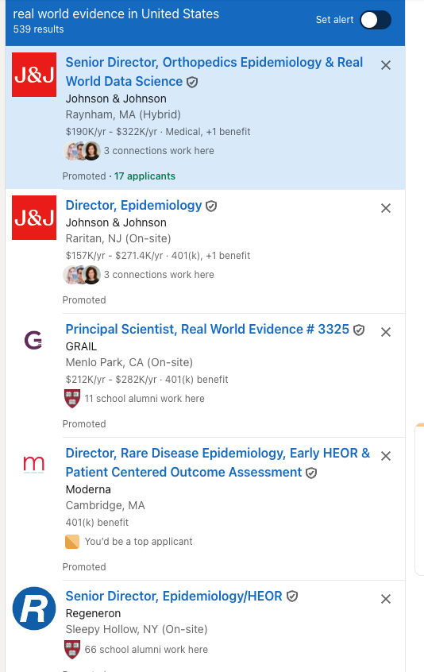
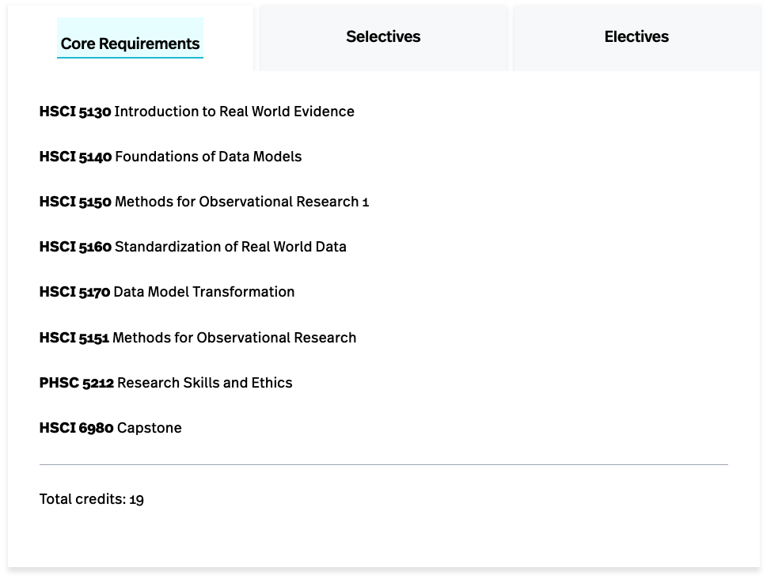
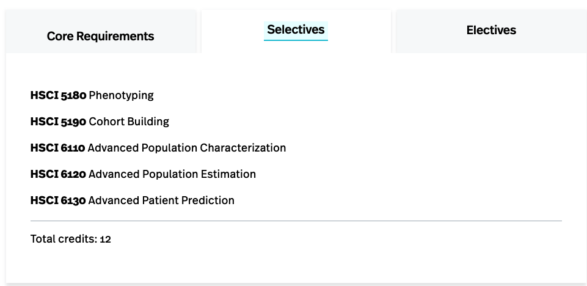

```{r setup, include=FALSE}
library(tidyverse)

knitr::opts_chunk$set(warning=FALSE, message=FALSE, fig.width=10.5, fig.height=4, comment=NA, rows.print=16)

gif_link <- function(link, file, size){
    knitr::asis_output(
      paste0('<center>\n<a href="',
             link,
             '">\n\n</a>\n</center>'
      ))
}


```

## Clinical Decision Making

- How do we (doctor?) decide what treatment to give to a patient? 
- How do we know if those treatments are safe? 


## Real-World Data

- Real-World Data are the data relating to patient health status and/or the delivery of health care routinely collected from a variety of sources.

- Sources
  - Electronic Health Records (EHRs)
  - Claims and billing data
  - Patient-generated data (including wearables)
  - Product and Patient registries

## Real-World Evidence
- RWE is the clinical evidence regarding the usage and potential benefits, or risks of a medical product derived from analysis of real-world data (RWD).

- RWE can be generated by different study designs or analyses, including but not limited to, randomized trials, including large simple trials, pragmatic trials, and observational studies (prospective and/or retrospective).

## RWE in the News
<center></center>

## RWE and AI

[RWE + AI](https://www.google.com/search?q=RWD+RWE+AI&oq=RWD+RWE+AI&gs_lcrp=EgZjaHJvbWUyBggAEEUYOTIHCAEQIRigATIHCAIQIRigATIHCAMQIRigATIHCAQQIRigAdIBCDE4NTVqMGo0qAIAsAIB&sourceid=chrome&ie=UTF-8#ip=1)

## Careers in RWE

<center></center>

## MS in RWE

 - New [MS degree at Northeastern](https://bouve.northeastern.edu/programs/real-world-evidence-in-healthcare-and-life-sciences-ms/)
 - 31 Credits
 - 100% online OR on-ground in Portland, Me
 - Faculty from academia and industry 
 - Emphasis on reproducible, reliable evidence generation
 
## MS in RWE
<center></center>

## MS in RWE
<center></center>


## Questions

Reach out! 

<a href="mailto:rwe@northeastern.edu"><i class="fa fa-paper-plane fa-fw"></i>&nbsp; rwe@northeastern.edu</a>


<center> THANK YOU! </center>